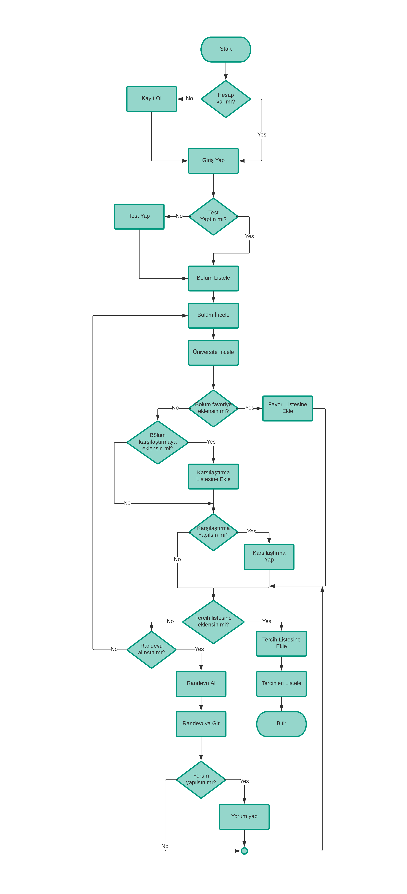
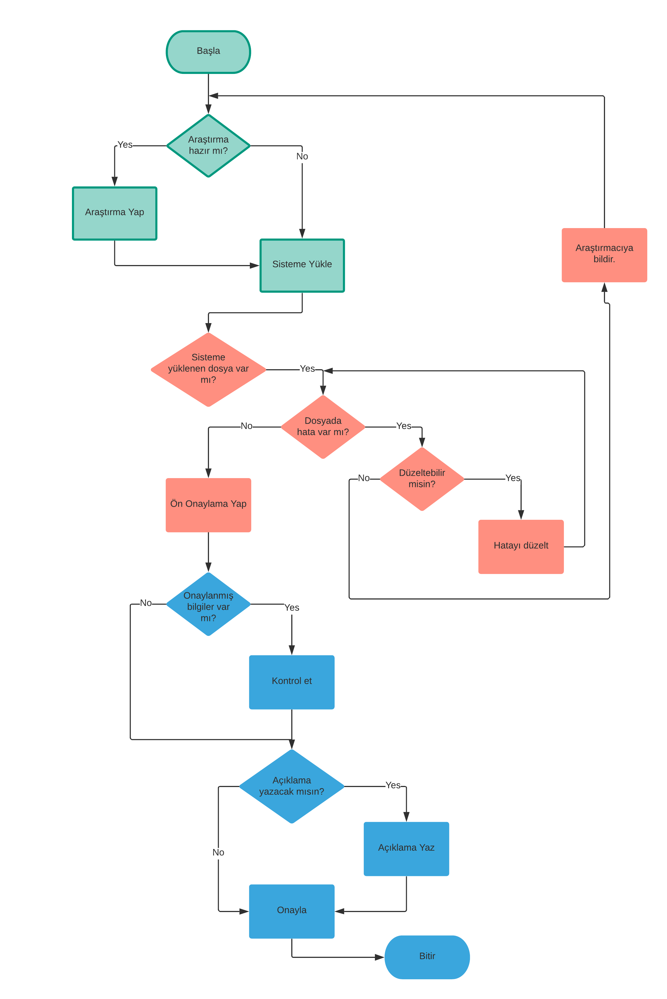
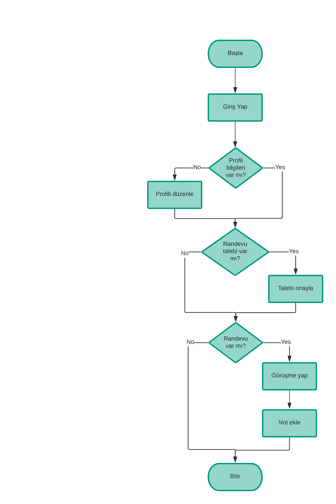
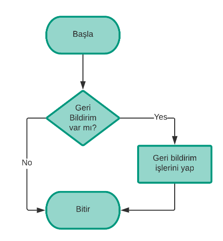

# İşlem Akış Şemaları

## **Tercih Diyagramı**

Öğrencilerin kendilerine en uygun bölümü tercih edebilmelerini sağlayan tercih işleminin nasıl gerçekleştirdiklerini gösteren diyagram.

## **Veri Oluştur Diyagramı**

Bölüm ve üniversite bilgilerinin nasıl elde edildiğini gösteren diyagram.

## **Danışman Diyagramı**

Danışmanların randevularını nasıl gerçekleştireceğini gösteren diyagram.

## **Moderatör Diyagramı**

Moderatörün içerikte bir sorun olması durumunda gelen bildirimleri nasıl uyguladığını gösteren diyagram.

