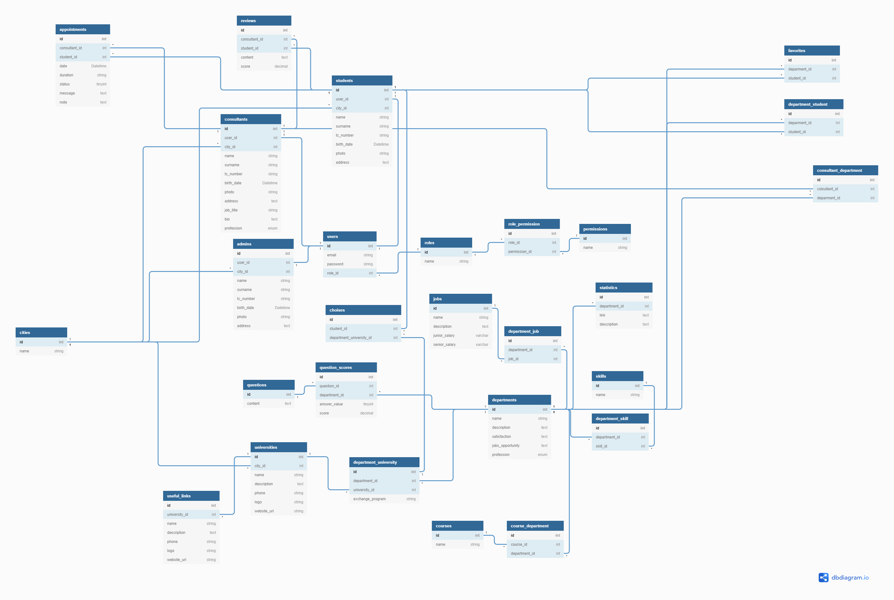

# Veritabanı

## **ER Diyagramı**

## **Tablolar Açıklaması**

### **Kullanıcılar:**

1. **users:** Kullanıcı bilgileri tutulur
2. **roles:** Kullanıcı rolleri tutulur.
3. **permission:** Sistemin izinleri tutulur
4. **roles\_permissions:** Role ve izinleri bağlayan tablo
5. **admins:** Adminlerin detaylı bilgileri tutulur.
6. **students:** Öğrencilerin detaylı bilgileri tutulur.
7. **consultants:** Danışmanların detaylı bilgileri tutulur.

### **Test:**

1. **questions:** Öğrencilere test yaparken sorulacak sorular tutulur.
2. **questions\_scores:** Her sorunun kaç puan olması gerektiği tutulur.

### **Bilgilendirme:**

1. **departments:** Bölümlerin bilgileri tutulur.
2. **courses:** Derslerin bilgileri tutulur.
3. **department\_courses:** Bölümleri ve dersleri birbirine bağlayan tablo.
4. **skills:** Becerilerin bilgileri tutulur.
5. **department\_skills:** Bölümleri ve becerileri birbirine bağlayan tablo.
6. **jobs:** Bölümlerden mezun olacakların hangi meslekleri tercih edeceği bilgiler tutulur.
7. **department\_jobs:** Bölümleri ve meslekleri birbirine bağlayan tablo.
8. **universities:** Üniversite bilgileri tutulur.
9. **department\_universities:** Bölüm ve üniversiteleri birbirine bağlayan tablo.
10. **useful\_links:** Üniversitelerin faydalı bilgileri tutulur.
11. **statistics:** Bölümlerin istatistiksel bilgileri tutulur.

### **Danışmanlık:**

1. **appointments:** Randevuların bilgileri tutulur.
2. **reviews:** Danışmanlara yapılan yorumlar tutulur.
3. **student\_departments:** Öğrencinin yaptığı test sonucunda okuyabileceği bölümler tutulur.
4. **consultant\_departments:** Danışmanların tavsiye verebilecekleri bölümler tutulur.

### **UX:**

1. **favorite:** Öğrencilerin favorilerine eklediği bölümler tutulur.
2. **choices:** Öğrencilerin tercih etmek istediği bölümler tutulur.

