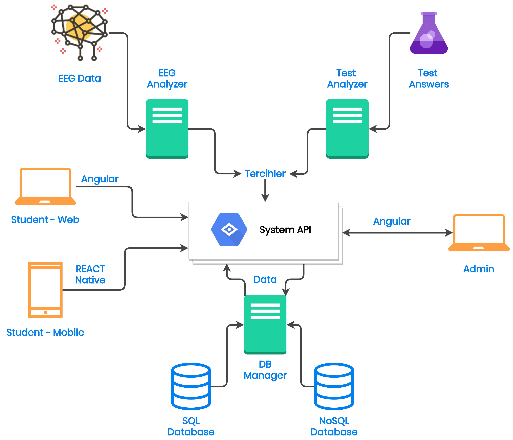
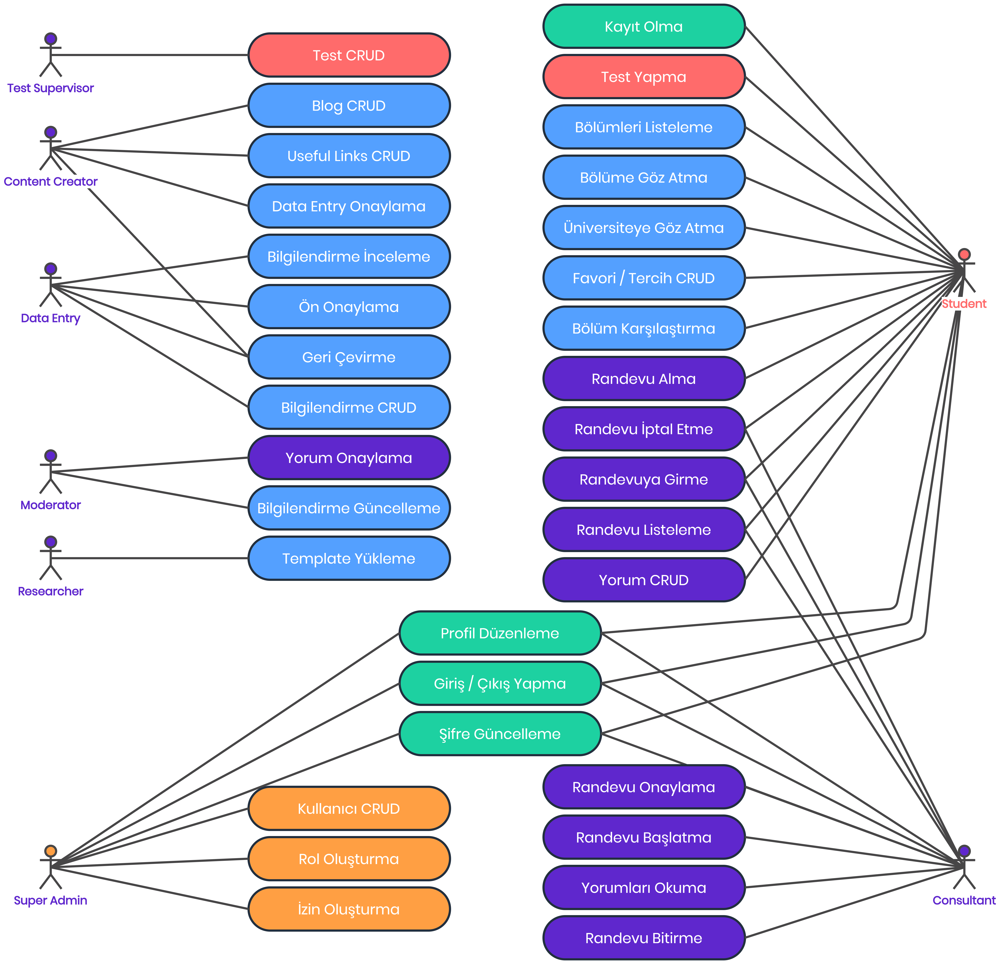

# Yazılım Mimarisi

## **Yapı Tasarımı** 

## **Röller**

| **Kullanıcı Tipi** | **İzin İsmi** |
| :--- | :--- |
| Admin | Super Admin |
| Admin | Test Supervisor |
| Admin | EEG Expert |
| Admin | Content Creator |
| Admin | Data Entry |
| Admin | Researcher |
| Admin | Moderator |
| Student | Student |
| Consultant | Consultant |

### **Admin Rolleri** 

* **Super Admin:** Sistemin genel yöneticisidir. Bütün işlemleri yapabilir. Ayrıca yeni kullanıcı ekleme, kullanıcılara rol verme ve yetkilendirme işlemlerini yapabilir. Test yapma, yorum yapma ve randevu alma işlemlerini yapamaz.
* **Test Supervisor:** Öğrencilerin test çözerken karşılarına çıkacak soruların düzenlenmesi işlemlerini gerçekleştirir. Bu işlemleri sürekli olarak yaparak testleri daha verimli hale getirir.
* **Eeg Expert:** Eeg cihazlarından gelen verileri düzenledikten sonra makine öğrenmesi algoritmasina uygun formata dönüştürür ve modeli geliştirir.
* **Researcher:** Bölüm ve üniversiteler için araştırmalar yaparak veri tabanında yer alacak verileri hazırlar ve belli bir taslak halinde sisteme yükler.
* **Data Entry:** Researcher’in yüklediği belgeleri kontrol edip veritabanına girişini yapar.
* **Content Creator:** Data Entry elemanının gerçekleştirdiği işlemleri onaylar. Bölüm ve üniversitelerin detaylı açıklamalarını girer.
* **Moderator:** İçerikte bir sorun olması durumunda gelen bildirimleri uygular.

## **Use Case Diyagramı**

Hangi kullanıcı rolünün hangi işlemleri yaptığını gösteren diyagram.

